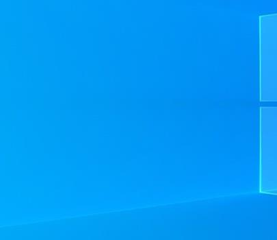

# 损失函数及其拓展
 01 目标检测结果精确度的度量
 目的：
1. 检测出图像中目标的位置，同一张图像中可能存在多个检测目标；
2. 检测出目标的大小，通常为恰好包围目标的矩形框；
3. 对检测到的目标进行识别分类；

 损失函数由三部分组成，分别为bbox边框回归损失、目标置信度损失、类别损失

定位损失box_loss：预测框与标定框之间的误差（GIoU）
置信度损失obj_loss：计算网络的置信度
分类损失cls_loss：计算锚框与对应的标定分类是否正确

把640*640的输入图像划分成N*N（通常为80*80、40*40、20*20）的网格，然后对网格的每个格子都预测三个指标：矩形框、置信度、分类概率。其中：

1. 矩形框：表征目标的大小以及精确位置。
2. 置信度：表征所预测矩形框（简称预测框）的可信程度，取值范围0~1，值越大说明该矩形框中越可能存在目标。
3. 分类概率：表征目标的类别。

所以在实际检测时：
https://zhuanlan.zhihu.com/p/458597638
1. 首先判断每个预测框的预测置信度是否超过设定阈值，若超过则认为该预测框内存在目标，从而得到目标的大致位置。
2. 接着根据非极大值抑制算法对存在目标的预测框进行筛选，剔除对应同一目标的重复矩形框（非极大值抑制算法我们后续再详细讲）。
3. 最后根据筛选后预测框的分类概率，取最大概率对应的索引，即为目标的分类索引号，从而得到目标的类别。

一、模型输出解析：

        设输出图片大小为1280，768，类别个数为2，则yolov5输出的三种特征图，其维度分别为：[1,3,96，160，7]，[1,3,48,80,7]，[1,3,24,40,7]；相当于yolov5模型总共输出（96*160+48*80+24*40）*3=60480个目标框；

        其中，[1,3,96,160,7] 中1指代输入图像个数为1，3指的是该尺度下的3种anchor，(96,160)  指的是特征图的尺寸，7具体指的是：（center_x,center_y, width, height, obj_conf, class_1_prob， class_2_prob ），即分别为box框中心点x,y,长和宽 width,height,以及该框存在目标的置信度obj_conf,类别1和类别2 的置信度,若class_1_prob > class_2_prob,则该框的类别为class1；因此，obj_conf和class_1_prob一个指得是该框存在目标的概率，一个指是该框分类为类别1的概率；

二、yolov5后处理解析;

        从一可知模型输出了60480个目标框，因此，要经过NMS进行过滤，进NMS之前需要经过初筛（即将obj_conf小于我们设置的置信度的框去除），再计算每个box框的综合置信度conf：conf = obj_conf * max(class_1_prob ,class_2_prob)，此时的conf是综合了obj_conf以及class_prob的综合概率；再经过进一步的过滤（即将conf小于我们设置的置信度的框去除），最后，将剩余的框通过NMS算法，得出最终的框；（NMS中用到了我们设置的iou_thres）；

        因此，最终我们可视化在box上方的置信度是综合了obj_conf以及class_prob的综合概率；

2. BCELoss是Binary CrossEntropyLoss的缩写，nn.BCELoss()为二分类交叉熵损失函数，只能解决二分类问题。 在使用nn.BCELoss()作为损失函数时，需要在该层前面加上Sigmoid函数，一般使用nn.Sigmoid()即可

nn.BCEWithLogitsLoss() = nn.sigmoid() + nn.BCELoss()

BCELoss(x,y)和BCEWithLogitsLoss(x,y)的 x 和目标 y：label（必须是one_hot形式）的形状相同。如下代码；

# 评价指标
1. 用IOU指标评价目标框和预测框的位置损失损失。
2. 用nn.BCEWithLogitsLoss或FocalLoss评价目标框和预测框的类损失和置信度损失 .

# build_targets函数解读

1. build_targets函数用于网络训练时计算loss所需要的目标框，即正样本。

# 笔记说明
  记录anchor的不同匹配机制
  [c](https://zhuanlan.zhihu.com/p/424984172)
  yolov5最重要的便是跨网格进行预测(跨网格的anchor匹配机制），从当前网格的上、下、左、右的四个网格中找到离目标中心点最近的两个网格，再加上当前网格共三个网格进行匹配。增大正样本的数量，加快模型收敛。

## 基于anchor和gt的IOU大小进行筛选匹配(yolov3-v4论文）
1. 在训练前根据标签聚类得出anchor信息；
2. 已知物体中心点坐标，那就以该点在所画框grid（26*26）里的左上角作为锚点，其对应着3个anchor，筛选出更合适的anchor
用来负责预测gt框；

### anchor匹配机制
* gt框对应的9个anchor也许与gt框相差较大，不适合利用该anchor来预测gt框
根据anchor和gt的IOU大小阈值进行筛选

## 基于anchor和gt的长宽比进行筛选匹配（v5版本的策略）

1. gt/anchor(宽高比r）： r=[wRatio,hRatio]
2. anchor/gt(宽高比1/r): 1/r=[wRatio_,hRatio_]
3. wRatio,hRatio,wRatio_,hRatio_通过与阈值进行比较，阈值，可以表明这些anchors的大小是与gt
框差不多大小的，其中心点又十分相近，则利用这些anchors预测gt框当然没问题。

4. tcls, tbox, indices, anch
tcls为gt框的类别；
tbox：gt框中心点相对于左上角的偏移量、gt框的宽高；
indices为图片索引，该图片在batch_size中第几张图片，3个anchor的索引0,1,2，图像gt框中心点坐标x轴取整，图像gt框
anch分别为3个anchors的宽高；

中心点坐标y轴取整；

5. yolov5相对于yolov3就是有一点的不同。总体来说，就是不仅仅如果对象的中心位置是在某个cell里，那

这个cell对应的预测结果就要对这个对象负责，还要利用与该gt框靠近的的两个cell来预测该gt

#  YOLOX的anchor free